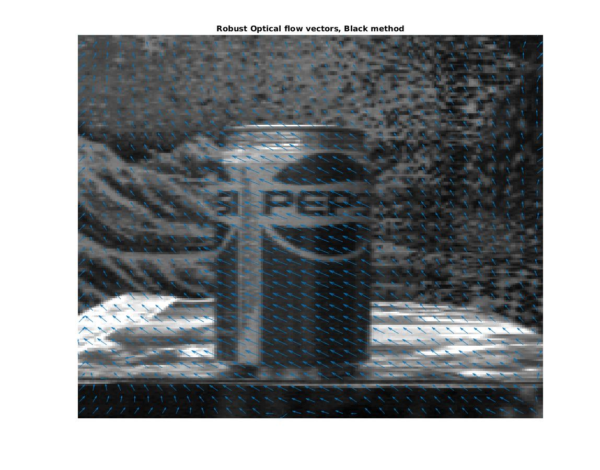

===========
robust-flow
===========

Helper code used with `Michael Black's Robust optical flow code <http://cs.brown.edu/people/black/code.html>`_

If you have interest in using Black's code with Matlab/Octave or Python, please start an 
issue and I can make this code more user friendly.

Install
=======
::

    cd src
    make

Example
=======
In Matlab/Octave::

    [u,v] = RunBlack('data/pepsi');

You will see this plot:

Functions
=========
GNC is the C program used for `Robust Estimation of Dense Optical Flow by Michael Black <http://cs.brown.edu/people/black/Papers/cviu.63.1.1996.html>`_.

===========     ==================
Function        Description
===========     ==================
DemoGNC         terminal script running the dense robust optical flow code
RunBlack        Nicer way to call GNC from Matlab with a variety of user-adjustable parameters
===========     ==================
